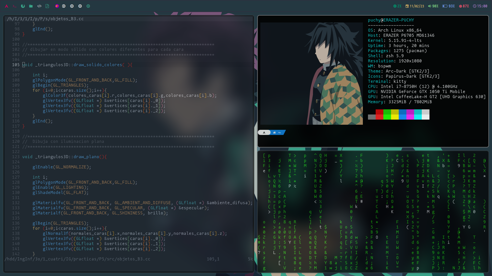
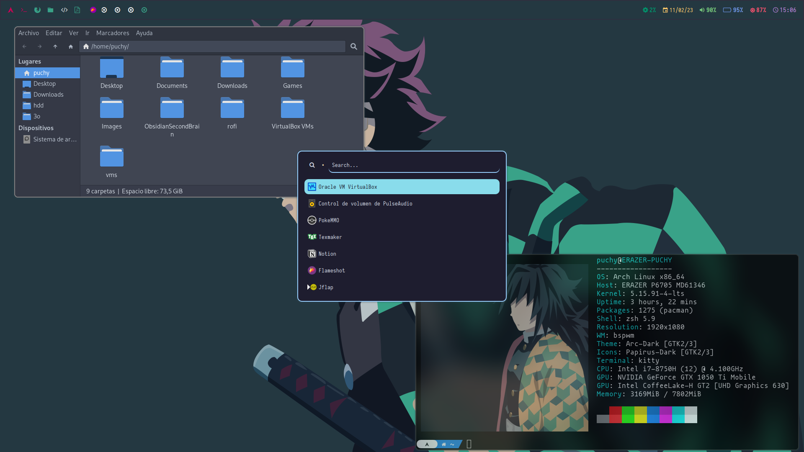

# Dotfiles

# ***Language***

- [Español]()
- English

# Table of contents

- [Software](#Software)
    - [Window Managers](#WM)
        - [Bspwm](#Bspwm)
        - [Qtile](#Qtile)
    - [Polybar](#Polybar)
    - [Rofi](#Rofi)
    - [Zsh](#zsh)
- [Keybindings](#Keybindings)
    
# Software

In this section you can find the basic software that I usually use in my desktops enviorements.
This is independent of the linux distribution you use. For example I used to use bspwm and kitty in my Arch Linux deskptop for daily use and Qtile and Alacritty in my parrotOS virtual machines.

List of common software:

- nvim
- [feh](https://feh.finalrewind.org/)
- [picom](https://wiki.archlinux.org/title/Picom)
- [flameshot](https://flameshot.org/)
- [arandr](https://christian.amsuess.com/tools/arandr/)
- thunar
- [zsh](#zsh)

## WM

### Bspwm

In the case of this wm is specified to work with feh to display a wallpaper, [polybar](#Polybar) as status bar, picom for window transparencies, 
[rofi](#Rofi) to run differents programs and kitty as terminal emulator.

More info in [Wiki](https://github.com/baskerville/bspwm).

#### Specific key binds

In this table are the keybinds most used by me that are not found in [keybindings](#Keybindings). You can change these keys editing the sxhdrc file . 

| Key                                                           | Action                           |
| ------------------------------------------------------------- | -------------------------------- |
| **mod + s**                                                   | set floating window              |
| **mod + t**                                                   | set tiling window                |
| **mod + f**                                                   | set full screen window           |
| **mod + alt + l** or **mod + alt + Right arrow**              | move floating window to right    |
| **mod + alt + h** or **mod + alt + Left arrow**               | move floating window to left     |
| **mod + alt + j** or **mod + alt + Down arrow**               | move floating window down        |
| **mod + alt + k** or **mod + alt + Up arrow**                 | move floating window up          |
| **mod + r**                                                   | open run menu                    |
| **mod + p**                                                   | open power menu                  |
| **mod + esc**                                                 | open screenshot menu             |

#### Preview

### Qtile 

## Polybar

I mainly use polybar with bspwm. To use this you need to install a [NerdFont](https://www.nerdfonts.com/) to be able to display the emojis (in my case I use Iosevka).
At the beginning of the file are defined the main colors that you can use in the rest of the file. 
The next part is the definition of the principal bar and another for a second monitor. The only different between boht are the emojis and some modules like battery.

More info in [Wiki](https://polybar.github.io/).

## Rofi

I use the Rofi launcher from https://github.com/catppuccin/rofi. It has four differents menus: one for launcher apps, other for run menu (commands from terminal),
powermenu and screenshot menu.
This file comes with is README in his file for more information.

## Zsh

As terminal emulator I always use zsh, I use it instead of other options such as bash or [fish](https://fishshell.com/) because zsh is compatible with other more important like *sh*
and it has a great community with a bunch of usefull plugins.

# Keybindings

These are most common keybindings in all my wm. Normally mod == windows key.

| Key                                                           | Action                         |
| ------------------------------------------------------------- | ------------------------------ |
| **mod + return**                                              | launch terminal                |
| **mod + w**                                                   | kill window                    |
| **mod + l** or **mod + Right arrow**                          | focus right window             |
| **mod + h** or **mod + Left arrow**                           | focus left window              |
| **mod + j** or **mod + Down arrow**                           | focus down window              |
| **mod + k** or **mod + Up arrow**                             | focus up window                |
| **mod + \[1234567890\]**                                      | go to workspace \[1234567890\] |
| **mod + shift + l** or **mod + shift + Right arrow**          | swap with right window         |
| **mod + shift + h** or **mod + shift + Left arrow**           | swap with left window          |
| **mod + shift + j** or **mod + shift + Down arrow**           | swap with down window          |
| **mod + shift + k** or **mod + shift + Up arrow**             | swap with up window            |
| **mod + ctrl + l** or **mod + ctrl + Right arrow**            | swap with right window         |
| **mod + ctrl + h** or **mod + ctrl + Left arrow**             | swap with left window          |
| **mod + ctrl + j** or **mod + ctrl + Down arrow**             | swap with down window          |
| **mod + ctrl + k** or **mod + ctrl + Up arrow**               | swap with up window            |
| **mod + alt + r**                                             | restart wm                     |
| **mod + alt + q**                                             | quit wm                        |
| **mod + d**                                                   | open app launcher              |
| **mod + alt + f**                                             | launch firefox                 |
| **mod + alt + a**                                             | launch file explorer           |

